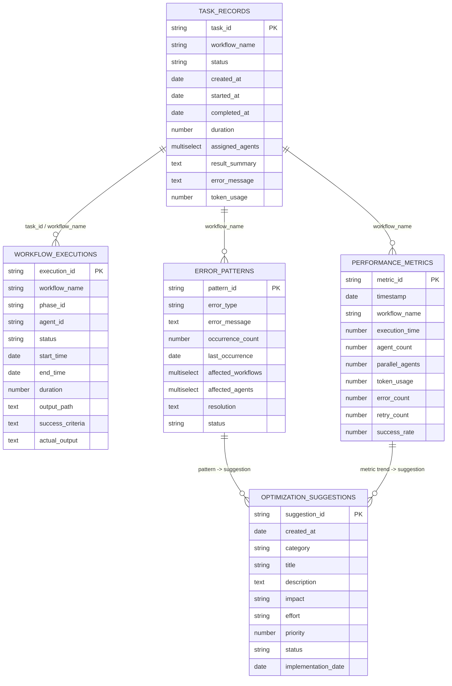

# TASK-005: Bitable 数据模型设计 (V0.0.4)

**目标版本**: V0.0.4  
**文档状态**: Ready for implementation  
**最后更新**: 2026-03-09

---

## 1. 设计目标

为 `openclaw-task-orchestrator` 设计 5 张核心 Bitable 表，覆盖：

1. 任务主记录（任务生命周期）
2. 工作流执行阶段记录（阶段/Agent 粒度）
3. 性能指标记录（时序指标）
4. 错误模式记录（可聚合错误）
5. 优化建议记录（迭代建议闭环）

设计原则：
- **可追踪**：任务 → 执行 → 指标/错误 → 建议 全链路可回溯
- **可扩展**：支持新增工作流、指标与维度
- **低耦合**：业务逻辑与 Bitable UI 字段展示分离
- **可自动化**：字段命名与脚本 `bitable-integration.sh` 一致

---

## 2. 逻辑实体关系 (ER)

> 注：Bitable 原生并不强制外键约束，关系由 `task_id/workflow_name/pattern_id` 等业务字段维护。

---

## 3. 表设计与字段约束

> 字段类型代码参考 Bitable API：
> - `1` 文本, `2` 数字, `3` 单选, `4` 多选, `5` 日期, `1001/1002` 系统时间

### 3.1 表 A: `task_records`

**用途**: 任务主生命周期记录（任务级别事实表）

| 字段名 | 类型(code) | 必填 | 约束/枚举 | 说明 |
|---|---:|:---:|---|---|
| `task_id` | 文本(1) | 是 | 逻辑唯一，格式 `TASK-*` | 任务业务主键 |
| `workflow_name` | 文本(1) | 是 | 非空 | 工作流名称 |
| `status` | 单选(3) | 是 | `pending/running/completed/failed/cancelled` | 任务状态 |
| `created_at` | 日期(5) | 是 | epoch ms | 创建时间 |
| `started_at` | 日期(5) | 否 | epoch ms | 开始时间 |
| `completed_at` | 日期(5) | 否 | epoch ms | 完成时间 |
| `duration` | 数字(2) | 否 | >= 0 | 执行时长(秒) |
| `assigned_agents` | 多选(4) | 否 | Agent ID 列表 | 分配执行者 |
| `result_summary` | 文本(1) | 否 | <= 5000 字 | 结果摘要 |
| `error_message` | 文本(1) | 否 | <= 5000 字 | 错误信息 |
| `token_usage` | 数字(2) | 否 | >= 0 | Token 消耗 |

**索引建议（逻辑）**:
- `task_id`（唯一查找）
- `status + created_at`（状态看板）
- `workflow_name + created_at`（按工作流统计）

---

### 3.2 表 B: `workflow_executions`

**用途**: 工作流阶段执行记录（execution/phase/agent 粒度）

| 字段名 | 类型(code) | 必填 | 约束/枚举 | 说明 |
|---|---:|:---:|---|---|
| `execution_id` | 文本(1) | 是 | 逻辑唯一 | 执行记录ID |
| `workflow_name` | 文本(1) | 是 | 非空 | 工作流 |
| `phase_id` | 文本(1) | 是 | `phase-*` | 阶段编号 |
| `agent_id` | 文本(1) | 是 | Agent ID | 执行 Agent |
| `status` | 单选(3) | 是 | `pending/running/completed/failed/skipped` | 阶段状态 |
| `start_time` | 日期(5) | 是 | epoch ms | 阶段开始 |
| `end_time` | 日期(5) | 否 | epoch ms | 阶段结束 |
| `duration` | 数字(2) | 否 | >= 0 | 时长秒 |
| `output_path` | 文本(1) | 否 | 路径/URI | 输出路径 |
| `success_criteria` | 文本(1) | 否 | <= 5000 字 | 成功标准 |
| `actual_output` | 文本(1) | 否 | <= 5000 字 | 实际输出 |

**索引建议（逻辑）**:
- `execution_id`
- `workflow_name + phase_id`
- `agent_id + start_time`

---

### 3.3 表 C: `performance_metrics`

**用途**: 性能与吞吐时序指标（可用于趋势分析）

| 字段名 | 类型(code) | 必填 | 约束/枚举 | 说明 |
|---|---:|:---:|---|---|
| `metric_id` | 文本(1) | 是 | 逻辑唯一 | 指标记录ID |
| `timestamp` | 日期(5) | 是 | epoch ms | 指标时间 |
| `workflow_name` | 文本(1) | 是 | 非空 | 工作流 |
| `execution_time` | 数字(2) | 是 | >= 0 | 执行时长秒 |
| `agent_count` | 数字(2) | 是 | >= 1 | Agent 总数 |
| `parallel_agents` | 数字(2) | 是 | >= 0 | 并行 Agent |
| `token_usage` | 数字(2) | 否 | >= 0 | Token 使用量 |
| `error_count` | 数字(2) | 否 | >= 0 | 错误数 |
| `retry_count` | 数字(2) | 否 | >= 0 | 重试次数 |
| `success_rate` | 数字(2) | 否 | 0~100 | 成功率 |

**索引建议（逻辑）**:
- `timestamp`（时间窗口）
- `workflow_name + timestamp`（按工作流趋势）

---

### 3.4 表 D: `error_patterns`

**用途**: 错误聚类与根因跟踪

| 字段名 | 类型(code) | 必填 | 约束/枚举 | 说明 |
|---|---:|:---:|---|---|
| `pattern_id` | 文本(1) | 是 | 逻辑唯一 | 错误模式ID |
| `error_type` | 文本(1) | 是 | 归类标签，如 `timeout` | 错误类型 |
| `error_message` | 文本(1) | 是 | 原始/归一化消息 | 错误描述 |
| `occurrence_count` | 数字(2) | 是 | >= 1 | 出现次数 |
| `last_occurrence` | 日期(5) | 是 | epoch ms | 最近发生时间 |
| `affected_workflows` | 多选(4) | 否 | workflow 名称列表 | 受影响工作流 |
| `affected_agents` | 多选(4) | 否 | agent 列表 | 受影响Agent |
| `resolution` | 文本(1) | 否 | <= 5000 字 | 解决方案 |
| `status` | 单选(3) | 是 | `open/investigating/resolved/ignored` | 处理状态 |

**索引建议（逻辑）**:
- `error_type + status`
- `last_occurrence`

---

### 3.5 表 E: `optimization_suggestions`

**用途**: 自动优化建议与执行状态闭环

| 字段名 | 类型(code) | 必填 | 约束/枚举 | 说明 |
|---|---:|:---:|---|---|
| `suggestion_id` | 文本(1) | 是 | 逻辑唯一 | 建议ID |
| `created_at` | 日期(5) | 是 | epoch ms | 建议生成时间 |
| `category` | 单选(3) | 是 | `performance/reliability/cost/quality/maintenance` | 建议类别 |
| `title` | 文本(1) | 是 | <= 200 字 | 标题 |
| `description` | 文本(1) | 是 | <= 5000 字 | 详细说明 |
| `impact` | 单选(3) | 是 | `high/medium/low` | 预期影响 |
| `effort` | 单选(3) | 是 | `high/medium/low` | 实施成本 |
| `priority` | 数字(2) | 是 | 1~10 | 优先级 |
| `status` | 单选(3) | 是 | `pending/accepted/implemented/rejected` | 建议状态 |
| `implementation_date` | 日期(5) | 否 | epoch ms | 实施时间 |

**索引建议（逻辑）**:
- `status + priority`
- `category + created_at`

---

## 4. 数据字典（统一规范）

### 4.1 状态枚举规范

- 任务/执行状态：
  - `pending`
  - `running`
  - `completed`
  - `failed`
  - `cancelled` / `skipped`

- 错误模式状态：
  - `open`
  - `investigating`
  - `resolved`
  - `ignored`

- 建议状态：
  - `pending`
  - `accepted`
  - `implemented`
  - `rejected`

### 4.2 时间字段规范

- 所有日期字段统一存储 **Epoch Milliseconds (UTC)**。
- 展示层（Bitable 视图）配置为本地时区可读格式。

### 4.3 标识符规范

- `task_id`: `TASK-<number|slug>`
- `execution_id`: `EXEC-<timestamp|uuid>`
- `metric_id`: `METRIC-<timestamp|uuid>`
- `pattern_id`: `PATTERN-<timestamp|uuid>`
- `suggestion_id`: `SUGG-<timestamp|uuid>`

---

## 5. API 字段映射（与脚本一致）

脚本 `bitable-integration.sh` 使用以下逻辑表名映射环境变量：

| 逻辑表名 | 环境变量 |
|---|---|
| `task_records` | `BITABLE_TABLE_TASK_RECORDS` |
| `workflow_executions` | `BITABLE_TABLE_WORKFLOW_EXECUTIONS` |
| `performance_metrics` | `BITABLE_TABLE_PERFORMANCE_METRICS` |
| `error_patterns` | `BITABLE_TABLE_ERROR_PATTERNS` |
| `optimization_suggestions` | `BITABLE_TABLE_OPTIMIZATION_SUGGESTIONS` |

建议：Bitable 字段名与本文字段名保持完全一致（英文蛇形命名），减少映射层复杂度。

---

## 6. 数据保留与归档策略（建议）

- `workflow_executions` / `performance_metrics`: 保留 90 天热数据，历史按月归档。
- `error_patterns`: 长期保留（用于趋势建模）。
- `optimization_suggestions`: 全量保留（用于复盘 ROI）。

归档策略可通过周期性导出 + 清理任务实现。

---

## 7. 验收清单（TASK-005）

- [x] 5 张表完整定义
- [x] 字段类型、约束、枚举定义
- [x] 关系模型（ER）
- [x] 数据字典
- [x] 与实现脚本字段命名对齐

---

## 8. 实施注意事项

1. Bitable 不提供强外键，需在应用层保证引用一致性。
2. 更新状态时建议写入时间戳（如 `started_at/completed_at`）。
3. 对高频写入的 metrics 建议批量写，降低 API 调用成本。
4. 建议在视图中预置：
   - 任务看板视图（按 status）
   - 执行耗时视图（按 duration desc）
   - 错误热点视图（按 occurrence_count desc）
   - 建议优先级视图（pending + priority）
